# NVDA Event-Driven Pipeline Architecture

This document provides visual diagrams of the project architecture, data flow, and directory structure.

---

## Table of Contents
1. [System Architecture](#system-architecture)
2. [Directory Structure](#directory-structure)
3. [Data Flow Sequence](#data-flow-sequence)
4. [Component Details](#component-details)

---

## System Architecture

This diagram shows the complete pipeline with all components and their relationships:


---

## Directory Structure

Visual representation of the project file organization:


---

## Data Flow Sequence

Step-by-step execution flow of the data fetching and processing pipeline:

```mermaid
sequenceDiagram
    participant User
    participant DF as data_fetching.py
    participant GNEWS as Google News
    participant POLY as Polygon API
    participant TZ as timezone_converter.py
    participant FS as File System

    User->>DF: python data_fetching.py --config config.yaml

    Note over DF: Step 1: Fetch News
    DF->>GNEWS: Query keywords for date range
    GNEWS-->>DF: Return articles with timestamps
    DF->>FS: Save news_YYYY-MM-DD.csv<br/>(Col 4: original timezone)

    Note over DF,TZ: Step 2: Auto Timezone Conversion
    DF->>TZ: process_news_csv(csv_path)
    TZ->>TZ: Parse timezone from Col 4
    TZ->>TZ: Convert to UTC (Col 5)
    TZ->>TZ: Convert to NY Time (Col 6-8)
    TZ->>FS: Overwrite CSV with conversions

    Note over DF: Step 3: Fetch Prices
    DF->>POLY: Query NVDA intraday bars
    POLY-->>DF: Return price data
    DF->>FS: Save nvda_prices_*.csv
    DF->>FS: Save metadata JSON

    Note over FS: All files stored in:<br/>data/demo_data/NVDA_DATE/
    FS-->>User: ✓ Complete dataset ready
```



---

## ML Training Pipeline Details

Detailed view of the machine learning model pipeline from data to predictions:

```mermaid
flowchart TD
    %% Phase 1: Data Collection
    subgraph Phase1["Phase 1: Data Collection"]
        NEWS[📰 News Articles<br/>Text + Timestamps]
        PRICES[📈 Stock Prices<br/>Intraday Bars]
        COMBINE[Combine by Date]

        NEWS --> COMBINE
        PRICES --> COMBINE
    end

    %% Phase 2: Sentiment Analysis
    subgraph Phase2["Phase 2: Sentiment Analysis"]
        VADER[VADER Analyzer<br/>Dictionary-based]
        SENT_SCORE[Sentiment Score<br/>-1.0 to +1.0]

        VADER --> SENT_SCORE
    end

    %% Phase 3: Feature Engineering
    subgraph Phase3["Phase 3: Feature Engineering"]
        FEAT1[sentiment_score]
        FEAT2[sentiment_squared<br/>non-linear effects]
        FEAT3[sentiment_abs<br/>strength measure]
        FEAT4[day_of_week<br/>0=Mon, 4=Fri]
        FEAT5[news_count<br/>volume of news]
        FEAT6[volatility<br/>historical volatility]

        FEATURE_VECTOR[Feature Vector X<br/>[0.65, 0.42, 0.65, 2, 5, 0.02]]

        FEAT1 --> FEATURE_VECTOR
        FEAT2 --> FEATURE_VECTOR
        FEAT3 --> FEATURE_VECTOR
        FEAT4 --> FEATURE_VECTOR
        FEAT5 --> FEATURE_VECTOR
        FEAT6 --> FEATURE_VECTOR
    end

    %% Phase 4: Model Training
    subgraph Phase4["Phase 4: Model Training (One-time)"]
        SPLIT[Train/Test Split<br/>80% / 20%]
        RF[Random Forest Regressor<br/>100 Decision Trees]
        UPPER_MODEL[Upper Margin Model<br/>Predicts max upside]
        LOWER_MODEL[Lower Margin Model<br/>Predicts max downside]
        EVALUATE[Evaluate Performance<br/>R² Score & MAE]
        SAVE[Save Model<br/>margin_predictor.pkl]

        SPLIT --> RF
        RF --> UPPER_MODEL
        RF --> LOWER_MODEL
        UPPER_MODEL --> EVALUATE
        LOWER_MODEL --> EVALUATE
        EVALUATE --> SAVE
    end

    %% Phase 5: Labels/Targets
    subgraph Labels["Training Labels (Ground Truth)"]
        LABEL_UPPER[Actual Upper Margin %<br/>max_price_next_3d - price_at_news]
        LABEL_LOWER[Actual Lower Margin %<br/>min_price_next_3d - price_at_news]
    end

    %% Phase 6: Prediction (Real-time)
    subgraph Phase5["Phase 5: Prediction (Real-time)"]
        LOAD_MODEL[Load Trained Model<br/>.pkl file]
        TODAY_DATA[Today's Data<br/>sentiment + price]
        PREDICT[Random Forest<br/>.predict]
        MARGINS[Predicted Margins<br/>upper_pct & lower_pct]
        CONVERT[Convert to Prices<br/>price × (1 + pct)]
        THRESHOLDS[Trading Thresholds<br/>Upper: $145.14<br/>Lower: $137.83]

        LOAD_MODEL --> PREDICT
        TODAY_DATA --> PREDICT
        PREDICT --> MARGINS
        MARGINS --> CONVERT
        CONVERT --> THRESHOLDS
    end

    %% Phase 7: Trading Decisions
    subgraph Phase6["Phase 6: Trading Execution"]
        MONITOR[Monitor Intraday Prices]
        SELL_SIGNAL[🔔 SELL Signal<br/>Price hits upper threshold]
        BUY_SIGNAL[🔔 BUY Signal<br/>Price hits lower threshold]

        MONITOR --> SELL_SIGNAL
        MONITOR --> BUY_SIGNAL
    end

    %% Main Flow Connections
    COMBINE --> VADER
    SENT_SCORE --> FEAT1
    SENT_SCORE --> FEAT2
    SENT_SCORE --> FEAT3

    FEATURE_VECTOR --> SPLIT
    LABEL_UPPER -.->|trains| UPPER_MODEL
    LABEL_LOWER -.->|trains| LOWER_MODEL

    SAVE --> LOAD_MODEL
    THRESHOLDS --> MONITOR

    %% Styling
    classDef dataClass fill:#fff3e0,stroke:#f57c00,stroke-width:2px
    classDef processClass fill:#e3f2fd,stroke:#1976d2,stroke-width:2px
    classDef modelClass fill:#e8f5e9,stroke:#388e3c,stroke-width:3px
    classDef decisionClass fill:#fce4ec,stroke:#c2185b,stroke-width:2px
    classDef labelClass fill:#f3e5f5,stroke:#7b1fa2,stroke-width:2px,stroke-dasharray: 5 5

    class NEWS,PRICES,SENT_SCORE,FEATURE_VECTOR,THRESHOLDS dataClass
    class COMBINE,VADER,FEAT1,FEAT2,FEAT3,FEAT4,FEAT5,FEAT6,SPLIT,CONVERT,MONITOR processClass
    class RF,UPPER_MODEL,LOWER_MODEL,SAVE,LOAD_MODEL,PREDICT modelClass
    class SELL_SIGNAL,BUY_SIGNAL decisionClass
    class LABEL_UPPER,LABEL_LOWER labelClass
```

### Pipeline Explanation

**Phase 1-3: Data Preparation**
- Collect news articles and stock prices
- Analyze sentiment using VADER (dictionary-based approach)
- Engineer 6 features from raw data including non-linear transformations

**Phase 4: Model Training** (One-time Process)
- Train two separate Random Forest models (upper & lower margins)
- Each forest contains 100 decision trees
- Split data 80/20 for training/testing
- Evaluate using R² score (explained variance) and MAE (mean absolute error)
- Models learn from historical: "Given sentiment X, price moved Y% up/down"

**Phase 5-6: Real-time Prediction**
- Load saved model (`margin_predictor.pkl`)
- Process today's news through same sentiment analysis
- Generate same features
- Predict percentage moves (upper_pct & lower_pct)
- Convert to absolute price thresholds
- Monitor prices and trigger buy/sell signals

### Key ML Concepts

| Component | Type | Purpose |
|-----------|------|---------|
| **VADER** | Rule-based NLP | Converts text → sentiment score |
| **Random Forest** | Ensemble ML | Averages 100 decision trees for robust predictions |
| **Feature Engineering** | Data preprocessing | Creates informative inputs (squared terms capture non-linearity) |
| **Train/Test Split** | Validation | Prevents overfitting, tests generalization |
| **R² Score** | Metric | Measures how well model explains variance (0-1 scale) |
| **MAE** | Metric | Average prediction error in percentage points |

### Data Flow Example

```
Input:  "NVIDIA announces new chip" (sentiment: +0.65)
        Current price: $140.50

Process: sentiment_score = 0.65
         sentiment_squared = 0.42  (capture non-linear effects)
         Features = [0.65, 0.42, 0.65, 2, 5, 0.02]

Output:  upper_pct = +3.3%  →  upper_margin = $145.14 (SELL)
         lower_pct = -1.9%  →  lower_margin = $137.83 (BUY)
```

---

## Component Details

### 1. Data Fetching Pipeline

**Purpose**: Collect news articles and stock price data

**Components**:
- `data_fetching.py` - Main orchestrator script
- `fetch_news.py` - Google News RSS scraper
- `timezone_converter.py` - Automatic timezone conversion (NEW)

**Workflow**:
1. Fetch news from Google News RSS based on keywords and date range
2. Save raw news data to CSV
3. Automatically convert timezones:
   - Column 4: Original timezone string
   - Column 5: UTC timestamp
   - Columns 6-8: NY timezone (date, time, formatted)
4. Fetch NVDA intraday price bars from Polygon API
5. Save price data and metadata

**Output Location**: `data/demo_data/NVDA_YYYY-MM-DD/`

---

### 2. Data Processing

**Purpose**: Clean and normalize data for training

**Components**:
- `normalize_news_times.py` - Additional time normalization

**Input**: Raw CSV files from data fetching
**Output**: Cleaned data ready for analysis

---

### 3. Training Pipeline

**Purpose**: Build ML models to predict trading margins from sentiment

**Components**:
- `train_ml_model.py` - Main training orchestrator
- `src/sentiment.py` - VADER sentiment analysis
- `src/margin_predictor.py` - ML margin prediction logic
- `src/train_margins.py` - Random Forest training
- `src/integrate_margins.py` - Combine sentiment scores with price data

**Model**: Random Forest classifier
**Output**: `models/margin_predictor.pkl`

---

### 4. Simulation Pipeline

**Purpose**: Backtest trading strategies with entry/exit signals

**Components**:
- `targetSimDate.txt` - Configuration file for simulation date
- `preSimulationController.py` - Auto-fetches required data
- `simPriceHelper.py` - Price data processing utilities
- `simulation_program.py` - Main simulation & visualization

**Workflow**:
1. Read target date from `targetSimDate.txt`
2. Auto-fetch news and price data via `data_fetching.py`
3. Process and prepare data
4. Run simulation with trading signals
5. Generate plots and performance metrics

**Output**: Trading signal plots and performance analysis

---

## Configuration

All components share configuration from `config/config.yaml`:

```yaml
apis:
  stocks:
    url: https://api.polygon.io/v2/aggs/ticker
    key: YOUR_POLYGON_API_KEY

ticker: NVDA
market_timezone: America/New_York

defaults:
  news_timezone: America/New_York
  news_date: 2025-10-13
  news_end_date: 2025-10-13
  price_date: 2025-10-13
  price_hours_after: 48
  price_trading_days: 3
  interval_minutes: 60
  keywords:
    - government shutdown
    - nvidia
```

---

## External Dependencies

### APIs
- **Google News RSS**: News article scraping
- **Polygon.io**: NVDA intraday stock price data

### Python Libraries
- **pandas**: Data manipulation
- **numpy**: Numerical operations
- **scikit-learn**: Machine learning (Random Forest)
- **vaderSentiment**: Sentiment analysis
- **matplotlib**: Visualization
- **feedparser**: RSS parsing
- **newspaper3k**: Article extraction
- **pytz/dateutil**: Timezone handling

---

## Quick Start Commands

### 1. Fetch Data
```bash
python data_fetching/data_fetching.py --config config/config.yaml
```

### 2. Train Model
```bash
python training/train_ml_model.py --training-data training_data.csv --output models/margin_predictor.pkl
```

### 3. Run Simulation
```bash
cd simulation
python preSimulationController.py
python simulation_program.py
```

---

## File Naming Conventions

- News CSV: `news_YYYY-MM-DD.csv` or `news_YYYY-MM-DD_to_YYYY-MM-DD.csv`
- Price CSV: `nvda_prices_YYYY-MM-DD.csv`
- Price Metadata: `nvda_price_metadata_YYYY-MM-DD.json`
- Model: `margin_predictor.pkl`

---

## Data Schema

### News CSV Columns
1. `title` - Article headline
2. `source` - News source
3. `url` - Article URL
4. `actual date and time` - Original timestamp with timezone
5. `published_date_utc` - UTC timestamp (YYYY-MM-DD HH:MM:SS)
6. `published_date_ny` - NY date (YYYY-MM-DD)
7. `published_time_ny` - NY time (HH:MM:SS)
8. `published_date_et` - NY datetime (MM/DD/YYYY HH:MM)
9. `summary` - Article summary/description
10. `content` - Full article content

### Price CSV Columns
1. `timestamp (UTC)` - UTC timestamp
2. `timestamp (America/New_York)` - Local NY timestamp
3. `weekday (America/New_York)` - Day of week
4. `open` - Opening price
5. `high` - High price
6. `low` - Low price
7. `close` - Closing price
8. `volume` - Trading volume
9. `pct_change_from_event` - Percentage change from first bar
10. `log_return` - Log return

---

*Generated: 2025-11-17*
